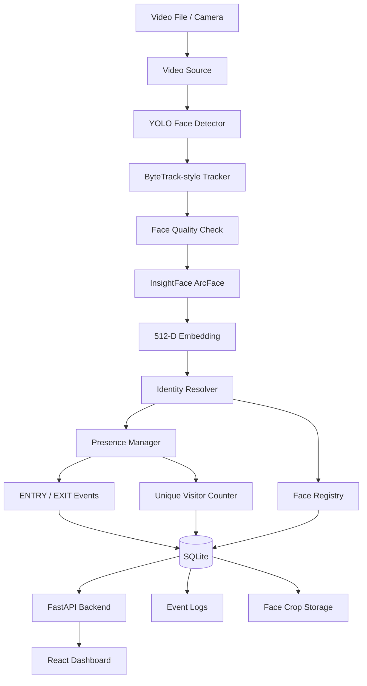

# Katomaran Face Intelligence & Visitor Analytics

An AI-powered face detection, tracking, recognition, and visitor analytics system with a web dashboard for processing video footage.

## Overview

Katomaran Face Intelligence converts video into visitor intelligence through an end-to-end pipeline:

**Video → YOLO face detection → ByteTrack-style tracking → InsightFace/ArcFace recognition → Identity resolution → Presence management → ENTRY/EXIT events → SQLite → FastAPI → React dashboard**

The system has been verified with real video and CPU inference.

## Key Features

- YOLOv8 face detection
- ByteTrack-style multi-object tracking
- InsightFace / ArcFace recognition
- 512-dimensional face embeddings
- Face registration and identity matching
- Known/unknown identity handling
- ENTRY and EXIT event generation
- Unique visitor counting
- SQLite persistence
- Face-crop and event logging
- FastAPI REST backend
- React + Vite + Tailwind dashboard
- Video upload and analysis workflow
- Visitor, event, analytics, registration, and system views

## Architecture



## AI Planning Document

### 1. Problem

The system must understand people appearing in video and convert raw frames into useful visitor information:

- Who is present?
- Is the person known or unknown?
- When did the person enter?
- When did the person leave?
- How many unique visitors appeared?
- What events occurred?
- How can the results be viewed?

### 2. Detection

YOLO detects faces in video frames.

**Input:** video frame  
**Output:** face bounding boxes and confidence scores.

### 3. Tracking

The ByteTrack-style tracker associates detections between frames so the same person is not treated as a new person on every frame.

**Input:** detections  
**Output:** persistent track IDs.

### 4. Recognition

InsightFace / ArcFace generates a face embedding. The verified project uses a 512-dimensional embedding representation.

### 5. Identity Resolution

Embeddings are compared with registered identities.

```text
Known identity → F001 / F002 / ...
Unknown identity → UNKNOWN
```

### 6. Presence Management

The presence manager maintains sessions and produces ENTRY/EXIT events. EXIT timestamps use the person's true last-seen time.

### 7. Persistence

Identity and event information are stored in SQLite. Face crops and structured logs are stored in the configured storage locations.

### 8. Dashboard

FastAPI exposes application data through REST APIs and React presents:

- statistics
- visitors
- events
- analytics
- registered faces
- system diagnostics
- video analysis reports

## Technology Stack

| Layer | Technology |
|---|---|
| Language | Python |
| Detection | YOLOv8 face model |
| Tracking | ByteTrack-style tracker |
| Recognition | InsightFace / ArcFace |
| Embeddings | 512-dimensional vectors |
| Runtime | ONNX Runtime |
| Computer Vision | OpenCV |
| Database | SQLite |
| Backend | FastAPI + Uvicorn |
| Frontend | React |
| Build Tool | Vite |
| Styling | Tailwind CSS |
| Testing | Pytest |

The verified inference provider is `CPUExecutionProvider`.

## Project Structure

```text
KATOMARAN-PROJECT/
├── katomaran-face-tracker/
│   ├── app/
│   │   ├── input/
│   │   ├── detection/
│   │   ├── tracking/
│   │   ├── recognition/
│   │   ├── registration/
│   │   ├── presence/
│   │   ├── database/
│   │   ├── storage/
│   │   └── event_logging/
│   ├── tests/
│   ├── models/
│   ├── data/
│   ├── logs/
│   ├── docs/
│   ├── config.json
│   ├── requirements.txt
│   └── README.md
├── katomaran-dashboard/
│   ├── backend/
│   └── frontend/
├── katomaran-interview-package/
└── README.md
```

## Setup Instructions

### Prerequisites

- Python 3.11+ / compatible verified project runtime
- Node.js and npm
- A machine capable of running the Python AI dependencies
- No NVIDIA GPU is required for the verified CPU configuration

### Python Environment

```bash
cd katomaran-face-tracker
python -m venv .venv
```

Windows:

```powershell
.venv\Scripts\activate
```

Install dependencies:

```bash
pip install -r requirements.txt
```

### Dashboard Dependencies

```bash
cd ../katomaran-dashboard/frontend
npm install
```

## Sample config.json Structure

```json
{
  "input": {
    "source": "sample_video.mp4"
  },
  "detection": {
    "model": "models/yolov8n-face.pt",
    "confidence": 0.5
  },
  "tracking": {
    "skip_frames": 4
  },
  "recognition": {
    "model": "buffalo_l",
    "device": "cpu"
  },
  "database": {
    "path": "data/faces.db"
  },
  "storage": {
    "logs": "logs"
  }
}
```

> This is a representative documentation structure. Use the shipped `config.json` as the authoritative configuration for the exact available keys and values.

## Running the Dashboard

### Production / All-in-one mode

```bash
cd katomaran-dashboard/backend
python main.py
```

Open:

```text
http://localhost:8000
```

### Development mode

Terminal 1:

```bash
cd katomaran-dashboard/backend
python main.py
```

Terminal 2:

```bash
cd katomaran-dashboard/frontend
npm run dev
```

Open the Vite URL shown by the terminal, normally `http://localhost:3000`.

## Video Analysis Workflow

The intended user workflow is:

```text
Open Dashboard
      ↓
Video Analysis
      ↓
Upload Hackathon Video
      ↓
Analyze Video
      ↓
Existing AI Pipeline
      ↓
YOLO → Tracking → InsightFace → Identity Resolution
      ↓
Presence / ENTRY / EXIT
      ↓
SQLite
      ↓
Analysis Report
      ↓
Display Results in Dashboard
```

The dashboard should use the existing AI pipeline rather than a second independent implementation.

## Dashboard

The dashboard contains:

- **Dashboard:** summary statistics, current presence, recent events, system status
- **Video Analysis:** upload/process video and display analysis results
- **Visitors:** recognized visitor records and visit history
- **Events:** ENTRY/EXIT timeline with filtering
- **Analytics:** visitor/event metrics
- **Registered Faces:** identity gallery
- **System:** model, database, runtime, and configuration diagnostics

## Assumptions

1. Input video can be opened by OpenCV.
2. Faces are sufficiently visible for detection and recognition.
3. Recognition quality depends on resolution, lighting, pose, blur, and occlusion.
4. Registered identities have suitable representative face images/embeddings.
5. CPU inference is acceptable for the hackathon workload.
6. SQLite is sufficient for the current prototype/hackathon scale.
7. The YOLO face model is available at the configured model path.
8. The InsightFace model pack is available through its expected model mechanism.
9. Dashboard values come from actual application data and are not fabricated.
10. Browser live-camera streaming is separate from the local OpenCV pipeline unless a streaming gateway is configured.
11. Production biometric deployments would require additional privacy, security, retention, consent, and compliance controls.
12. Test videos are assumed to be provided with appropriate permission for hackathon evaluation.

## Testing and Verification

The existing AI test suite was verified at:

```text
93/93 tests passed
100% pass rate
```

Real-video validation also passed for the verified test video.

Verified capabilities include:

- YOLO detection
- ByteTrack-style tracking
- InsightFace recognition
- 512-dimensional embeddings
- face registration
- ENTRY/EXIT detection
- unique visitor counting
- SQLite persistence
- face-crop storage
- structured event logging
- dashboard integration

A verified real 4K MP4 benchmark was approximately **16.9 FPS** on CPU. Performance varies by hardware, video resolution, and workload.

## Performance / Runtime

Previously verified runtime information includes:

```text
Python: 3.13.2
PyTorch: CPU build
Ultralytics: 8.4.172
ONNX Runtime: 1.30.0
InsightFace: 2.0
Execution Provider: CPUExecutionProvider
```

No NVIDIA GPU is required for the verified configuration.

## Limitations

- CPU inference is slower than a suitable GPU deployment.
- Recognition can degrade with blur, occlusion, extreme pose, poor lighting, or very small faces.
- Direct browser live-video streaming from an RTSP camera requires a WebRTC/MJPEG or equivalent gateway.
- SQLite is suitable for the current prototype/hackathon workload; high-concurrency production use may require a scalable database.
- Production biometric use requires additional privacy and security controls.

## Demo Video

### Loom / YouTube Demonstration

**IMPORTANT: Replace the placeholder below with the actual Loom or YouTube URL before submitting.**

```text
VIDEO_LINK_TO_BE_ADDED
```

The explanatory video should demonstrate:

1. Project overview
2. Architecture
3. Application startup
4. Dashboard
5. Uploading a hackathon video
6. AI processing
7. Detection/tracking/recognition
8. ENTRY/EXIT results
9. Visitor report
10. Dashboard analytics

**Do not submit the README with the placeholder still present.**

## Future Improvements

- Browser-based live camera streaming using WebRTC
- RTSP camera integration
- Background processing for long videos
- GPU inference support
- Authentication and role-based access
- Production database such as PostgreSQL
- Stronger biometric data protection
- Data retention policies
- Docker/cloud deployment

## Hackathon Requirement

This project is a part of a hackathon run by https://katomaran.com
