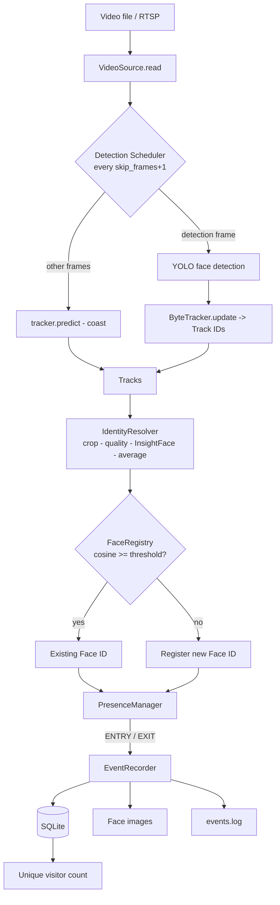

# Architecture

## Pipeline (as implemented)



## Modules and responsibilities

| Module | Responsibility | Knows nothing about |
|---|---|---|
| `input/video_source.py` | Frames + timestamps from file or RTSP | models, DB |
| `detection/yolo_detector.py` | image -> `Detection` list | tracking, identity |
| `tracking/tracker.py` | detections -> stable Track IDs; coasting | faces' identity |
| `recognition/quality.py` | accept/reject a crop | embeddings |
| `recognition/face_recognizer.py` | crop -> embedding (InsightFace) | DB, presence |
| `recognition/identity_resolver.py` | Track ID -> Face ID (per-track state) | SQL |
| `recognition/face_matcher.py` | cosine search over in-memory gallery | DB |
| `registration/face_registry.py` | existing vs new person; registers | presence |
| `presence/presence_manager.py` | state machine -> ENTRY/EXIT | models, DB, files |
| `presence/event_recorder.py` | event -> image + DB row + log (with retry queue) | vision |
| `database/sqlite_repository.py` | ALL SQL | business rules |
| `storage/image_store.py` | safe paths + atomic image writes | DB |
| `event_logging/event_logger.py` | structured `events.log` | everything else |
| `pipeline.py` | per-frame orchestration | concrete model classes (injected) |
| `app_factory.py` | builds the real object graph | - |

## Four different concepts

| Concept | Produced by | Lifetime | Example |
|---|---|---|---|
| Detection | YOLO | one frame | box (40,60,120,140), conf 0.91 |
| Track ID | tracker | until the track is lost; can change | 17 |
| Face ID | recognition/registry | permanent | F003 |
| Presence state | PresenceManager (per Face ID) | one visit | PRESENT / MISSING / ABSENT |

Presence is keyed by **Face ID**, so when the tracker assigns a new Track ID to the same person after an occlusion, no second ENTRY is produced.

## Per-frame flow

1. `read()` a frame (invalid frames skipped; unrecoverable problems raise `SourceError`).
2. `tracker.predict()` on every frame (boxes coast using estimated velocity).
3. If `DetectionScheduler` says so (every `skip_frames+1`-th frame): YOLO -> `tracker.update()` (two-stage IoU association: high-confidence first, then low-confidence for leftover tracks; new tracks from unmatched high-confidence detections).
4. For every track matched to a *fresh* detection: `IdentityResolver.resolve()`. Resolved tracks cost nothing further; unresolved tracks run the quality gate and (if good) one embedding; after `embeddings_per_decision` embeddings the average is matched/registered.
5. `PresenceManager.update()` with all identified, visible faces -> ENTRY for faces that were ABSENT. Faces not seen this cycle become MISSING.
6. `PresenceManager.expire()` on every frame -> EXIT(`person_left`) when MISSING longer than `max_missing_seconds`.
7. Each event -> `EventRecorder` (image, SQLite row, log line).
8. On stop or end of file: `PresenceManager.shutdown()` -> EXIT(`shutdown`) for everyone still present.

## Presence state machine

```
ABSENT --(observed)------------------------------> PRESENT   emit ENTRY
PRESENT --(not observed in a detection cycle)----> MISSING   (no event)
MISSING --(observed before timeout)--------------> PRESENT   (no event)
MISSING --(unseen > max_missing_seconds)---------> ABSENT    emit EXIT (person_left)
PRESENT|MISSING --(shutdown)---------------------> ABSENT    emit EXIT (shutdown)
```
ENTRY is only emitted on `ABSENT -> PRESENT`; EXIT only on `-> ABSENT`. No other path emits events, which is what guarantees one ENTRY and one EXIT per visit.

## Recognition design

- Embeddings are L2-normalised; similarity = cosine = dot product (range -1..1, higher = more similar).
- Match if `similarity >= recognition.similarity_threshold`, otherwise register. The threshold is a **starting value** to calibrate (`scripts/calibrate_threshold.py`).
- Too low: false matches (two people share an ID, count too low). Too high: false non-matches (one person gets several IDs, count too high).
- Embedding dimension is measured from the model at start-up and recorded in the database; a different model/dimension is rejected (`IncompatibleEmbeddingError`).

## Tracker: what is and is not ByteTrack

Implemented: ByteTrack's two-stage high/low-confidence association, and track creation only from high-confidence detections. Simplified: damped constant-velocity motion instead of a Kalman filter; greedy IoU assignment instead of Hungarian. The `Tracker` interface (`predict()`, `update()`) is small, so Ultralytics' `BYTETracker` or BoT-SORT can replace it without touching the pipeline.

## Frame skipping trade-off

More frequent YOLO: better robustness to fast motion/occlusion, more compute. Less frequent: less compute, more drift while coasting, and a short appearance can be missed. Keep `detection interval < max_missing_seconds` (the pipeline warns if not).
